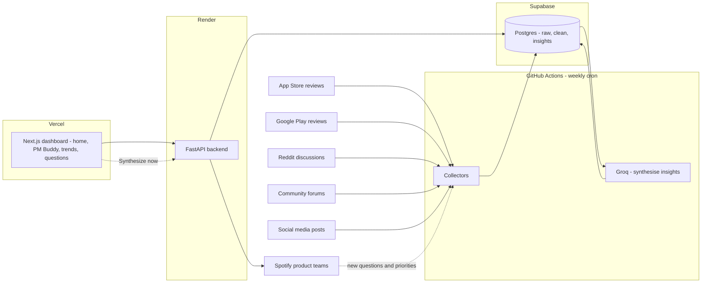
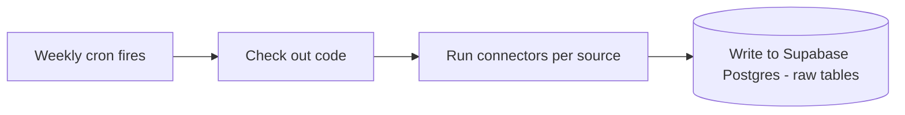
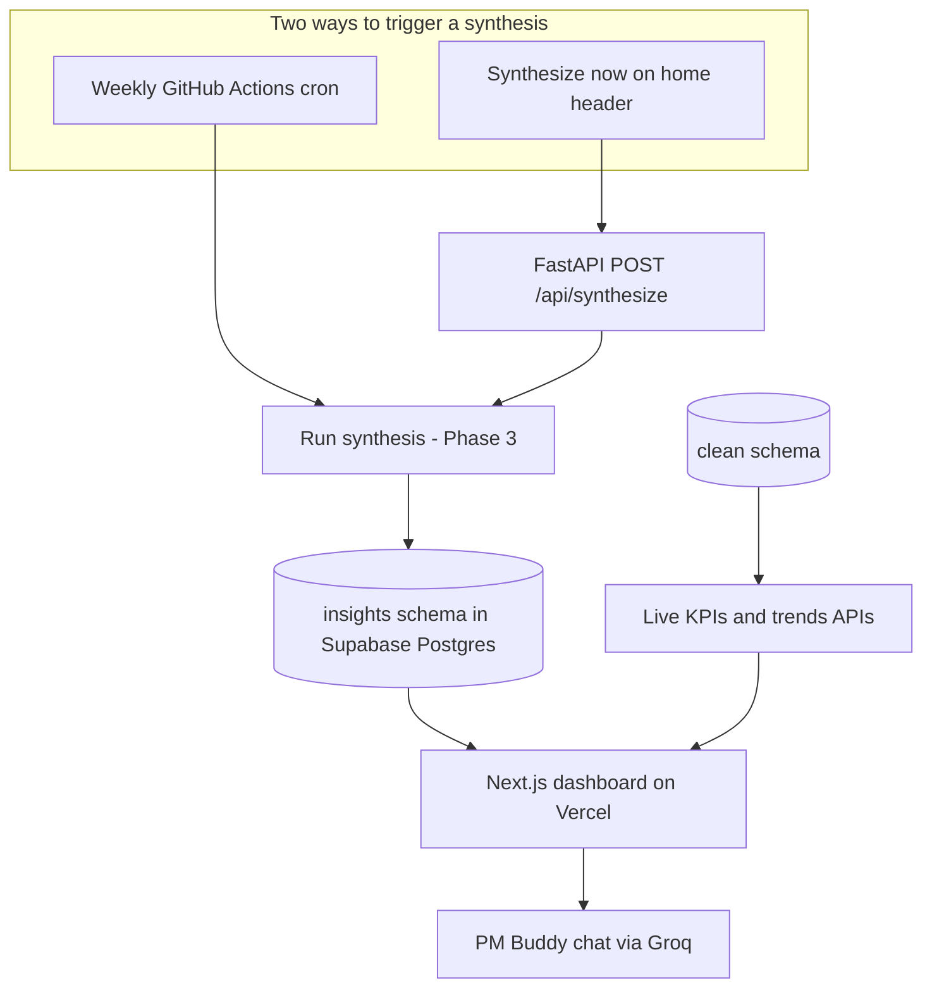
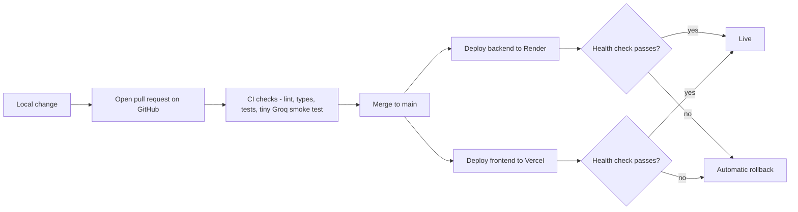

# Architecture: Understanding Barriers to Music Discovery at Spotify

## How to read this document

This document explains, in plain English, how we will turn the questions raised in [problemstatement.md](problemstatement.md) into a working solution. It is written so that anyone on the team - technical or not - can follow along.

A few ground rules used throughout:

- We **name the chosen tools** (for example, Groq, Render, Vercel), but every named tool still gets a one-line plain-English explanation the first time it appears, and again in the **Glossary** at the end.
- Because the problem statement already spells out our goals and desired outcomes in detail, we **skip the heavy planning phases and jump straight to building**. The few setup decisions we still need are captured once in the short "Before we build" section below, then we get going.
- The build is split into **six phases**. Hard, complex work is deliberately placed in its own phase so that no single phase tries to do everything at once.

## What we are building, in one paragraph

Spotify wants to know **why** users keep replaying familiar music instead of discovering new music. The answer lives inside the things users already write online - app store reviews, Reddit posts, community forum threads, and social media chatter. We will build a pipeline that quietly collects this public feedback, cleans it up, uses a large language model to read it, turns the readings into clear answers to six business questions, and shows those answers on a dashboard that product teams can act on - and keep refreshing as new feedback arrives.

## Chosen technology stack

These are the tools we have picked. Each is explained in one plain-English line here, and again in the Glossary.

- **Python + FastAPI (backend)** - Python is the programming language; FastAPI is a popular toolkit for building a web "API" (the backend's front door that the website talks to). Hosted on **Render**.
- **Render (backend hosting)** - a cloud service that runs our FastAPI backend.
- **Supabase (database)** - a managed **Postgres** database in the cloud where we store the raw, clean, and insights tables.
- **Next.js (frontend)** - a popular toolkit for building fast, modern websites. Hosted on **Vercel**.
- **Vercel (frontend hosting)** - a cloud service that publishes our website and gives every change a preview link.
- **Groq (the LLM provider)** - a service that runs large language models (LLMs - software that reads and writes human language) very fast. We use it to read feedback and to draft summaries.
- **GitHub (code + automation)** - where our code lives, and where **GitHub Actions** runs scheduled jobs (the weekly data collection and the weekly synthesis).
- **Google Stitch (design reference)** - a design tool whose mock-ups we use as the visual reference for the dashboard.

## Before we build

We do not need a separate goal-setting or planning phase, because [problemstatement.md](problemstatement.md) already defines what success looks like. We simply carry a handful of assumptions and guardrails into the build:

- **Definition of success** - we can answer the six key questions from the problem statement with evidence (counts plus real user quotes). This is already written down; we do not re-derive it.
- **Initial scope** - a **one-time initial extract** pulls as much feedback as each source exposes within the past **three months** (`INITIAL_LOOKBACK_DAYS=90`), with **no artificial pagination caps**. After go-live, only **weekly** (incremental since last run) and **ad-hoc** (last **7 days**) collection runs append new data.
- **Legal and access** - before we collect from a source, we confirm its terms of service allow automated collection and storage, and record that decision per source. This is a quick checklist at the start of Phase 1, not a phase of its own.
- **Privacy** - personal information (PII - things like a real name, email, or phone number) is masked during cleaning (Phase 2) and never shown on the dashboard.

With those settled, everything below is building.

## High-level picture

Two things in this picture matter most. First, the weekly heavy lifting (collecting and reading feedback) runs inside **GitHub Actions**, writing into one **Supabase Postgres** database, so there is no always-on worker to babysit. Second, the dashboard has a **"Synthesize now"** control on the **home header** (alongside **Export Report**) that triggers an **ad-hoc collection** (last 7 days) plus a fresh synthesis, in addition to the automatic weekly run. **PM Buddy** and **live review trends** read from the same backend without waiting for a new synthesis run.

---

## Phase 1 - Setup and Data Collection

**Goal:** Stand up the foundations (database, repository, per-source access check) and build the "pipes" that bring raw feedback in from each source on a schedule, stored untouched.

**What happens, in plain English:**
We start by standing up the basics: a **Supabase Postgres** database, a **GitHub** repository, and a quick per-source check that its terms of service allow collection (the guardrail from "Before we build"). That is the entire setup - no drawn-out planning, because the problem statement already tells us what we are after.

Then we build the collectors. For each source we write a small **connector** - a piece of software whose only job is to ask the source for new feedback and drop it into storage. We do **not** clean, translate, or interpret anything yet. We just bring it in and save the original copy in a **raw zone** (a set of "raw" tables in Supabase Postgres where we keep the unedited truth). This is on purpose: if we later improve our cleaning logic, we can re-run it against the original raw data instead of re-collecting from the source.

**Where this runs:** the collectors run **inside a GitHub Actions workflow**. There are three collection modes:

| Mode | Trigger | Time window | Limits |
|---|---|---|---|
| **Initial** | Run once before go-live (`--initial`) | Past three months (`INITIAL_LOOKBACK_DAYS`, default 90) | **None** — paginate until each source is exhausted |
| **Weekly** | Monday cron (default) | Everything since the last successful run per source | Paginate within window; append only |
| **Ad-hoc** | Dashboard button or manual workflow dispatch | Last **7 days** (`ADHOC_LOOKBACK_DAYS`) | Paginate within window; append only |

There is no always-on server to maintain; GitHub spins up a machine, runs the collectors, writes to the database, and shuts down. Weekly runs collect "everything since the last successful run", so a missed week is automatically caught up the next time it runs. All modes append via upsert — existing rows are never deleted.

**Inputs:** The problem statement, the chosen stack, and public documentation of each source.

**Outputs:**
- A Supabase Postgres database and a GitHub repository.
- One connector per source, runnable from the GitHub Actions workflow.
- A set of "raw" tables holding original feedback, tagged by source and collection run.
- A weekly schedule (incremental), plus ad-hoc and initial modes triggerable by hand when needed.

**Who is involved:** Data engineer, with legal sign-off on each source.

**Risks to watch for:**
- A source whose terms forbid automated collection. Check before building the connector.
- A source going down or changing its format and no one noticing. Each connector needs a small health check.
- A weekly run failing partway. Each source is collected as an independent step so a partial run is still usable and only the missing sources need re-running.

> Why this is its own phase: this is the plumbing that everything else depends on. Getting reliable collection in place first means later phases always have data to work with.

---

## Phase 2 - Storage, Standardization and Cleaning

**Goal:** Turn five different-looking piles of feedback into one consistent, clean pile that the rest of the pipeline can rely on.

**What happens, in plain English:**
A Reddit post, a 5-star App Store review, and a tweet all look very different. In this phase we agree on a **common shape** that every piece of feedback will be reshaped into - imagine a simple form with the same fields filled in for every record:

- A unique ID.
- Which source it came from.
- When it was posted.
- The text itself.
- A rating, if there is one.
- The language it is written in.
- Country or region, if known.
- Any hints about the user (free vs paid, new vs long-time), if available.

We also remove obvious duplicates (the same review copy-pasted multiple times), trim out things that are clearly not useful (empty posts, spam), mask any personal information, and detect the language of each piece of text. The cleaned data is saved into a separate **clean** set of tables, leaving the raw tables untouched.

**Where this lives:** everything sits in the same **Supabase Postgres** database. The "raw zone" and "cleaned zone" are not separate systems - they are just two sets of tables (a `raw` schema and a `clean` schema) inside that one database. A **schema** here simply means a labelled group of tables. Keeping both in one database makes it easy to trace any clean row back to its raw original.

**Inputs:** The raw tables from Phase 1.

**Outputs:**
- A `clean` schema in Supabase Postgres with one consistent record shape.
- A small "data quality" report (how many duplicates, how many languages, how much was dropped and why).

**Who is involved:** Data engineer, analytics engineer.

**Risks to watch for:**
- Cleaning too aggressively and losing real user voice (sarcasm, slang, emojis can all carry meaning).
- Forgetting to keep a link back to the original raw record, which makes auditing impossible.

> Why this is its own phase: collection and cleaning are different skills. Splitting them means a problem in one does not block the other.

---

## Phase 3 - Insight Generation (SQL aggregation + Groq synthesis)

**Goal:** Answer the six business questions from the problem statement using **all** cleaned reviews — without calling Groq once per review.

**What happens, in plain English:**
Phase 2 already tags each review with `topics_matched` (discovery, recommendations, listening behaviour, etc.). Phase 3 **aggregates in Python/SQL** — counts by topic, source, and rating, and selects representative quotes (up to 30 per question). Only then does **Groq** run **~7 calls total** (one per research question plus an executive summary), turning stats + quotes into readable answers.

The six questions answered:

1. Why do users struggle to discover new music?
2. What are the most common frustrations with recommendations?
3. What listening behaviours are users trying to achieve?
4. What causes users to repeatedly listen to the same content?
5. Which user segments experience different discovery challenges?
6. What unmet needs emerge consistently across reviews?

We **prioritise** pain points by frequency, low star ratings, and spread across sources. Every narrative is anchored to real counts and verbatim quotes — the model does not see the full 23k-row corpus, only summaries.

**Where this runs:** the same **GitHub Actions weekly workflow** as Phases 1–2. Aggregation is free (no Groq). Synthesis uses ~30–50k Groq tokens per full run — well within the free-tier daily cap (`100k` tokens/day for `llama-3.3-70b-versatile`).

**Inputs:** The `clean` schema from Phase 2 (`topics_matched`, `cleaned_text`, `source`, `rating`).

**Outputs:**
- An `insights` schema in Supabase Postgres with `question_answers`, `executive_summary`, and `synthesis_runs`.
- Structured answers to all six questions with supporting stats and quotes.

**Who is involved:** Analytics engineer, user researcher, product analyst.

**Risks to watch for:**
- Confusing volume with importance — score on frequency **and** rating **and** source spread.
- Groq summaries that drift from the data — every claim must cite stats or a provided quote.
- Thin segments — report coverage honestly when segment hints are missing.

> Why this approach: per-review LLM tagging would need ~18M tokens for our corpus. Aggregating first, then synthesising, answers the business questions in one day instead of months.

---

## Phase 4 - Visualization and Storytelling (Next.js on Vercel)

**Goal:** Make the insights from Phase 3 effortless to consume for product teams, executives, and researchers - in one beautiful frontend.

**What happens, in plain English:**
Even great insights are useless if no one reads them. This phase builds the "front of house" as a **Next.js** website hosted on **Vercel**. The look and feel follows design references from **Google Stitch** (a design tool whose mock-ups we treat as the visual blueprint).

The frontend reads from the **FastAPI backend** on Render. Synthesis answers come from the `insights` schema; live KPIs and trends are computed from the `clean` schema at request time so numbers stay current even between synthesis runs.

**Dashboard pages (as built):**

| Route | Purpose |
|---|---|
| `/` | Executive overview — live KPIs (`dataset_stats`), executive summary, top pain points and opportunities, source-mix donut, six question preview cards |
| `/pm-buddy` | **PM Buddy** — Groq chat copilot grounded in dataset stats, repetitive-listening signals, segment breakdown, and synthesis evidence |
| `/questions/q1` … `/questions/q6` | One page per research question — ranked themes, narrative, source donut, rating chart, filterable quote gallery |
| `/trends` | Live review trends — dual-axis chart (net sentiment + average rating) with Weekly / Monthly / Yearly granularity |
| `/runs` | Synthesis run history |
| `/synthesis` | In-progress synthesis status |

**Navigation and performance:**
- A fixed **sidebar** links Home, PM Buddy, Trends, History, and Q1–Q6; routes are prefetched for fast tab switching.
- **`InsightsDataProvider`** caches the insights bundle and trends (~60 seconds) at the app root so revisiting pages feels instant.
- **`QuestionsBundleProvider`** shares the bundle across question pages without refetching on every navigation.

**Home header actions (not in the sidebar):**
- **Export Report** — generates a multi-page PDF snapshot of home, all six questions, and trends.
- **Synthesize now** — triggers ad-hoc refresh (see below).

**Question page behaviour:**
- Source filter chips sit **above** the quote gallery and sync with charts.
- Mentions-by-source is shown as a **donut chart** (consistent with the home source mix).
- Representative quotes are balanced across sources and prefer lower star ratings when refreshed on API read.
- No per-page Synthesize button and no audit footer.

**Trends (live, not run-over-run):**
Trends are computed from **`clean.feedback_items`** by posting date, not by comparing theme counts across synthesis runs. Each period reports review volume, average star rating, and a **net sentiment score** derived from ratings (4–5★ positive, 3★ neutral, 1–2★ negative; net % = `(positive − negative) / rated_count × 100`). This is a rating proxy, not Groq text sentiment.

**PM Buddy:**
`POST /api/pm-buddy/chat` builds a structured evidence context (dataset scale, repetitive-listening keywords, segment hints, latest synthesis, sample quotes) and calls Groq so product managers can explore hypotheses about repetitive listening and discovery friction with citations. Requires `GROQ_API_KEY` on the backend.

**Two ways to refresh the insights:**
Insights can be regenerated either automatically or on demand:

1. **Weekly, automatically** - the GitHub Actions cron from Phases 1-3 runs end-to-end every week (incremental collection since last run, then synthesis).
2. **Ad-hoc, on demand** - **Synthesize now** on the home header runs the full pipeline via `POST /api/synthesize`: **incremental collection** (since each source's last successful run), **cleaning** of new raw items only, then **synthesis** on the full corpus. The backend rejects overlapping runs (409) while one is already in progress.

**Inputs:** Structured insights from Phase 3, live cleaned reviews for KPIs/trends, served through the FastAPI backend.

**Outputs:** A live Next.js dashboard on Vercel with executive overview, six question explorers, live trends, run history, PM Buddy, and PDF export.

**Who is involved:** Frontend developer, data visualisation specialist, user researcher, product lead.

**Risks to watch for:**
- Pretty but misleading charts. Every chart needs a clear "so what".
- Building for analysts instead of for product managers. The audience here is decision-makers.
- The Synthesize button being pressed repeatedly or colliding with the weekly run. A single active synthesis at a time prevents overlap.
- Stale backend processes after deploy — an orphaned uvicorn worker can serve old routes (for example PM Buddy 404) until restarted.
- Rating-based trend sentiment can diverge from how users describe feelings in text — label it clearly.

> Why this is its own phase: presentation iterates on a different rhythm than analysis. The dashboard might change weekly while the underlying Groq prompts are left untouched for months.

---

## Phase 5 - Continuous Monitoring, Feedback Loop and Iteration

**Goal:** Keep the system useful as the world, and Spotify, change.

**What happens, in plain English:**
User feedback is a moving target. New features launch, new complaints appear, sentiment shifts. In this phase the pipeline becomes a **living service**, and GitHub Actions makes much of this easy:

- **Trend tracking** over time, so we can see when a theme starts rising before it becomes a crisis.
- **Run history as the audit log** - every weekly GitHub Actions run is recorded, so we always know when data was last collected and synthesised.
- **Failure notifications** - a red run posts an alert (email or chat) so a missed or broken run never goes unnoticed.
- A regular **prompt/model refresh** cadence: language evolves and Groq model versions change, so we re-check accuracy and adjust prompts at planned intervals, pinning the model version we rely on.
- A documented **feedback loop** back to product teams: a weekly review meeting fed by the latest synthesis run turns insights into product action, and the next round of feedback shows whether the changes worked.

**Inputs:** The full pipeline running end-to-end, plus product team responses to insights.

**Outputs:**
- Trend dashboards.
- Failure alerts wired to the weekly workflow.
- A scheduled review meeting where insights are translated into product action.
- A versioned record (including which Groq model version) of what changed in each refresh.

> **Implementation:** [`phase5-operations/`](../phase5-operations/) — `ops` schema, drift monitor CLI, GitHub Actions `phase5-monitor.yml`, and weekly review templates.

**Who is involved:** Data engineer, data scientist, product lead, user researcher.

**Risks to watch for:**
- Treating the project as "done" after Phase 4. Without monitoring, the pipeline silently rots.
- Insights that never reach product teams in a form they can use.

> Why this is its own phase: operations is a different mindset from delivery. Splitting it makes "keeping it healthy" a real, owned activity, not an afterthought.

---

## Phase 6 - Deployment, CI/CD and Fail-proofing

**Goal:** Get the backend, frontend, and automation live - and keep them live - in a way that makes it hard to ship something broken.

> **Step-by-step deploy guide:** [deployment.md](deployment.md) — Render, Vercel, GitHub secrets, smoke tests, and troubleshooting.

**What happens, in plain English:**
All the code lives in one **GitHub** repository, organised into `backend/` (the FastAPI app), `frontend/` (the Next.js app), and `.github/workflows/` (the GitHub Actions jobs). Changes flow through a safe, automated path before they ever reach real users.

**CI/CD** is the umbrella term here: **CI** (Continuous Integration) automatically checks every change, and **CD** (Continuous Deployment) automatically ships the good ones.

The three deployment targets:

- **Backend (FastAPI) on Render** - auto-deploys from the `main` branch. Secrets (the Groq API key, the Postgres connection string, and source API keys) live in Render's secret store, never in code. A **health-check route** (a URL Render pings to confirm the app is alive) means a broken deploy is caught and rolled back automatically.
- **Frontend (Next.js) on Vercel** - auto-deploys from the same repo. Every pull request gets a **preview deployment** (a temporary live link) so designers can compare against the Google Stitch references before anything merges. Production promotes from `main`. The backend URL and other settings are stored as per-environment variables.
- **Code on GitHub** - the `main` branch is **protected**, meaning changes must arrive via a pull request that passes checks. Workflow secrets live in GitHub Actions secrets.

**Fail-proofing checklist:**

- Branch protection on `main`, so nothing reaches production without review.
- Required CI checks before merge: code style (lint), type-checking, unit tests, and a small smoke test that sends Groq a tiny prompt to confirm the key works.
- Render and Vercel both roll back automatically when a health check fails.
- GitHub Actions workflows retry on transient failures and post an alert (email or chat) on a red run.
- Database changes run as a separate step before the backend deploys, with a dry-run first, and prefer additive, backward-compatible changes.
- Two environments - `staging` and `production` - on both Render and Vercel. Staging gets every merge; production is promoted on purpose. They never share a database.
- A short **break-glass runbook** in the repo: how to roll back a deploy, rotate the Groq key, and re-run a failed weekly synthesis.

**Inputs:** Working backend, frontend, and workflows from the earlier phases.

**Outputs:** Automated, reviewed deployments to Render and Vercel; a protected repo; and a written runbook for emergencies.

**Who is involved:** Backend developer, frontend developer, data engineer, with product sign-off on what reaches production.

**Risks to watch for:**
- A secret accidentally committed to the repo. Secret-scanning and a git-ignored `.env` guard against this; rotate immediately if it happens.
- Staging and production getting crossed (for example, the live site pointing at the staging database). Separate variables and a startup check prevent it.

> Why this is its own phase: shipping safely is a discipline of its own. Keeping deployment separate means the build phases stay focused on what to build, while this phase guarantees it reaches users without breaking.

---

## Phase dependency table

This table is for non-technical readers who want to understand which phases must finish before others can start.

| Phase | Depends on | Can start in parallel with | Blocks |
|---|---|---|---|
| 1. Setup & Data Collection | The "Before we build" guardrails | Early planning of Phase 2 | Phase 2 |
| 2. Storage, Standardization & Cleaning | Phase 1 | Early planning of Phase 3 | Phase 3 |
| 3. Insight Generation (SQL + Groq synthesis) | Phase 2 | Early sketches for Phase 4 | Phase 4 |
| 4. Visualization & Storytelling | Phase 3 | Nothing | Phase 5 |
| 5. Monitoring & Iteration | Phase 4 (end-to-end run) | Phase 6 | Future improvements |
| 6. Deployment, CI/CD & Fail-proofing | Phase 1 | Phases 2-5 (set up early, refined throughout) | Anything reaching real users |

## Suggested rough sequencing

We describe phases by **relative effort** rather than weeks.

| Phase | Relative effort | Notes |
|---|---|---|
| 1. Setup & Data Collection | Medium | Quick setup, then five connectors, each with its own quirks. |
| 2. Storage, Standardization & Cleaning | Medium | The "common shape" decision takes care; the rest is mechanical. |
| 3. Insight Generation (SQL + Groq synthesis) | Medium | Aggregation is free; ~7 Groq calls per full run. |
| 4. Visualization & Storytelling | Medium | Iterates frequently after launch. |
| 5. Monitoring & Iteration | Ongoing | Becomes business as usual. |
| 6. Deployment, CI/CD & Fail-proofing | Medium | Set up early, refined throughout the project. |

A pragmatic approach is to take **one source end-to-end first** - collect it, clean it, synthesise insights, and show a single answer - before adding the other four. This proves the whole pipeline works on a small scale before scaling out.

---

## Mapping back to the problem statement

Every phase exists to serve the six key questions from [problemstatement.md](problemstatement.md). This table makes the link explicit.

| Key question from problem statement | Primary phase that answers it | Supporting phases |
|---|---|---|
| 1. Why do users struggle to discover new music? | Phase 3 | Phase 2 |
| 2. What are the most common frustrations with recommendations? | Phase 3 | Phase 2 |
| 3. What listening goals are users trying to accomplish? | Phase 3 | Phase 2 |
| 4. What drives repetitive listening behaviour? | Phase 3 | Phase 2 |
| 5. How do discovery challenges vary across user segments? | Phase 3 | Phase 2 (segment hints), Phase 4 |
| 6. What unmet needs consistently emerge? | Phase 3 | Phase 5 (over time) |

The success criteria from the problem statement (root causes, prioritisation, segment differences, emerging trends, evidence-based opportunities) are covered jointly by Phases 3, 4, and 5.

---

## Glossary

A short reference for non-technical readers. Each term is explained in plain English.

- **API (Application Programming Interface)** - an official "front door" that a service offers so other programs can ask for data in a clean, predictable way. Easier and safer to use than reading a webpage.
- **Branch protection** - a GitHub setting that stops anyone from changing the main code directly; changes must go through a reviewed pull request.
- **CI/CD (Continuous Integration / Continuous Deployment)** - the automated path that checks every change (CI) and ships the good ones to production (CD).
- **Cleaned zone (clean schema)** - the tables where feedback has been reshaped into a single common format and de-duplicated. Used by every step after cleaning.
- **Connector** - a small piece of software whose only job is to talk to one external source and bring data back.
- **Cron** - a timer that automatically runs a job on a set schedule (for example, every week).
- **Dashboard** - a visual page (charts, numbers, quotes) where people read insights without needing to run code.
- **Entity recognition** - software identifying named things inside text, like artist names, genres, or product features.
- **Environment variable** - a setting (like a secret key or a web address) kept outside the code so it can differ between staging and production and stay private.
- **FastAPI** - a Python toolkit for building a backend API quickly. Runs on Render.
- **GitHub / GitHub Actions** - GitHub stores our code; GitHub Actions runs automated jobs (our weekly collection and synthesis) for us.
- **Google Stitch** - a design tool whose mock-ups we use as the visual reference for the dashboard.
- **Groq** - a service that runs large language models very fast; we use it to read feedback and draft summaries.
- **Health check** - a URL that a hosting service pings to confirm the app is actually alive after a deploy.
- **LLM (Large Language Model)** - software trained to read and write human language; the kind of model Groq runs.
- **Net sentiment (trends)** - a dashboard metric derived from star ratings (not NLP): 4–5★ positive, 3★ neutral, 1–2★ negative; net % = `(positive − negative) / rated_count × 100`.
- **Next.js** - a toolkit for building fast, modern websites. Our frontend, hosted on Vercel.
- **NLP (Natural Language Processing)** - software that reads and understands human language.
- **PII (Personally Identifiable Information)** - any information that could identify a specific person, such as a real name, email address, or phone number. Handled with extra care.
- **Pipeline** - the full chain of steps from raw data to insight, working like an assembly line.
- **PM Buddy** - a Groq-powered chat copilot on the dashboard that answers product-strategy questions using live dataset stats, repetitive-listening signals, and synthesis evidence.
- **Postgres** - the database (an organised store of tables) we run in Supabase to hold the raw, clean, and insights data.
- **Supabase** - a cloud service that provides our managed Postgres database and related tooling.
- **Rate limit** - a cap on how often a source allows us to ask for data. Going over the limit can get us blocked.
- **Raw zone (raw schema)** - the tables where feedback is kept exactly as it arrived from the source, untouched.
- **Render** - the cloud service that hosts our FastAPI backend.
- **Rollback** - automatically returning to the last working version when a new deploy is found to be broken.
- **Schema** - a labelled group of tables inside a database (for example, the `raw`, `clean`, and `insights` schemas).
- **Segment** - a group of users who share something in common (for example, premium users, or users in a specific country).
- **Sentiment analysis** - software estimating whether a piece of text is positive, negative, neutral, or mixed.
- **Theme / topic detection** - software grouping pieces of feedback by what they are about, even when they use different words.
- **Vercel** - the cloud service that publishes our Next.js website and gives every change a preview link.
- **workflow_dispatch** - a way to start a GitHub Actions job by hand (used by the "Synthesize now" button when it chooses to trigger the workflow).

---

## Summary

We skip the heavy planning and start building immediately, because the problem statement already tells us what we need. We build six small, well-defined steps, in order:

1. Set up the basics and bring the data in (weekly, via GitHub Actions).
2. Make it consistent and clean (in Supabase Postgres).
3. Aggregate cleaned feedback and use Groq to synthesise answers to the six business questions.
4. Show the answers clearly in a Next.js dashboard on Vercel — executive home, six question pages, live trends, PM Buddy, run history, and PDF export.
5. Keep it all running and useful.
6. Deploy it safely and make it hard to break.

By keeping each phase focused on a single kind of work, we make the project easier to plan, easier to staff, easier to debug, and - most importantly - easier for everyone on the team to follow.
