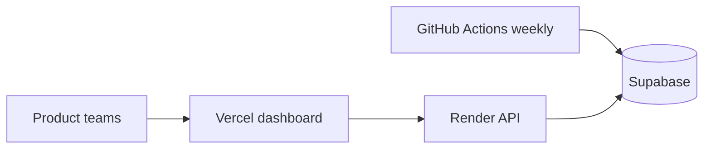

# Deployment guide (Phase 6)

This guide walks through deploying the **NL Spotify / Music Discovery Insights** stack before Phase 5 operations work. It matches [architecture.md](architecture.md) Phase 6: **Render** (backend), **Vercel** (frontend), and **GitHub Actions** (weekly data pipeline).

## What runs where

| Component | Host | Trigger | Purpose |
|-----------|------|---------|---------|
| Next.js dashboard | **Vercel** | Push to `main` | UI — home, questions, trends, PM Buddy, PDF export |
| FastAPI backend | **Render** | Push to `main` (or Blueprint) | API, PM Buddy, live trends, **Synthesize now** |
| Phases 1–3 pipeline | **GitHub Actions** | Monday 02:00 UTC cron + manual | Scheduled collect → clean → synthesize |
| Database | **Supabase** | — | `raw`, `clean`, `insights` schemas |



> **Important:** The dashboard **Synthesize now** button runs Phases 1–3 inside the Render web service (background thread). The **weekly cron** should stay on GitHub Actions — it is more reliable for long jobs and does not depend on the web service staying awake.

---

## Prerequisites

Before you start, have these ready:

- [ ] GitHub repository with this code pushed to `main`
- [ ] [Supabase](https://supabase.com) project with migrations applied (`raw`, `clean`, `insights`, `ops` schemas)
- [ ] At least one successful **Phase 3 synthesis** (so `/api/insights/latest` returns data)
- [ ] [Groq](https://console.groq.com) API key
- [ ] [Render](https://render.com) account
- [ ] [Vercel](https://vercel.com) account (GitHub login recommended)

---

## Step 1 — Push code to GitHub

1. Create a private GitHub repo (if you have not already).
2. Ensure `.env` and `frontend/.env.local` are **not** committed (they are in `.gitignore`).
3. Push `main`:

```bash
git remote add origin https://github.com/YOUR_ORG/nl-spotify.git
git push -u origin main
```

---

## Step 2 — Configure GitHub Actions secrets

The workflow [`.github/workflows/pipeline.yml`](../.github/workflows/pipeline.yml) runs the weekly collect → clean → synthesize jobs.

In GitHub: **Settings → Secrets and variables → Actions → New repository secret**

| Secret | Value |
|--------|-------|
| `SUPABASE_PROJECT_URL` | `https://xxxx.supabase.co` |
| `SUPABASE_PROJECT_ANON_KEY` | Supabase anon/public key |
| `SUPABASE_JWT_SECRET` | Optional; leave empty if unused |
| `GROQ_API_KEY` | Groq API key |
| `ALERT_WEBHOOK_URL` | Optional — Slack/Discord webhook for Phase 5 alerts |

**Test the pipeline:** **Actions → Data Pipeline (Phases 1-3) → Run workflow** → mode `probe` (cheap) or `weekly`.

**Phase 5:** After applying [`phase5-operations/sql/`](../phase5-operations/sql/) in Supabase, the **Phase 5 Monitor** workflow runs automatically after a successful pipeline (see [`phase5-operations/README.md`](../phase5-operations/README.md)).

---

## Step 3 — Deploy the backend to Render

### Option A — Blueprint (recommended)

1. In Render: **New → Blueprint**.
2. Connect your GitHub repo.
3. Render reads [`render.yaml`](../render.yaml) at the repo root.
4. When prompted, fill in **sync: false** secrets:
   - `SUPABASE_PROJECT_URL`
   - `SUPABASE_PROJECT_ANON_KEY`
   - `GROQ_API_KEY`
   - `CORS_ORIGINS` — your production Vercel URL, e.g. `https://nl-spotify.vercel.app` (add after Step 4 if unknown yet)
   - `REDDIT_USER_AGENT` — e.g. `nl-spotify-collector/1.0 (contact: you@example.com)`
5. Deploy. Note the service URL, e.g. `https://nl-spotify-api.onrender.com`.

### Option B — Manual web service

| Setting | Value |
|---------|-------|
| **Root directory** | *(repo root — leave blank)* |
| **Runtime** | Python 3.11 |
| **Build command** | `pip install -r backend/requirements-deploy.txt` |
| **Start command** | `PYTHONPATH=backend/src uvicorn backend_api.main:app --host 0.0.0.0 --port $PORT` |
| **Health check path** | `/health` |

Add the environment variables from [`.env.example`](../.env.example). At minimum:

```
SUPABASE_PROJECT_URL=...
SUPABASE_PROJECT_ANON_KEY=...
GROQ_API_KEY=...
GROQ_MODEL=llama-3.3-70b-versatile
CORS_ORIGINS=https://your-production-domain.vercel.app
CORS_ORIGIN_REGEX=https://.*\.vercel\.app
REDDIT_USER_AGENT=nl-spotify-collector/1.0 (contact: you@example.com)
ENABLED_SOURCES=app_store,google_play,reddit,community_forum,social_media
```

`CORS_ORIGIN_REGEX` allows Vercel **preview** deployments (PR branches) without listing every preview URL.

### Verify backend

```bash
curl https://YOUR-SERVICE.onrender.com/health
# → {"status":"ok"}

curl https://YOUR-SERVICE.onrender.com/api/insights/latest
# → 200 with bundle JSON, or 404 if no synthesis run yet
```

**Render notes:**

- **Starter plan** may spin down when idle; the first request after idle can take 30–60s (see [edgecases.md](edgecases.md) §4.4).
- **Synthesize now** can run 5–10+ minutes in a background thread. Avoid triggering it repeatedly — Groq’s free tier has a **100k tokens/day** cap.
- Use **GitHub Actions** for the reliable weekly refresh; use the dashboard button for ad-hoc runs only.

---

## Step 4 — Deploy the frontend to Vercel

1. In Vercel: **Add New → Project** → import your GitHub repo.
2. **Root Directory:** `frontend` (critical — the Next.js app is not at repo root).
3. Framework preset: **Next.js** (auto-detected).
4. **Environment variables** (Production + Preview):

| Variable | Value |
|----------|-------|
| `NEXT_PUBLIC_API_URL` | `https://YOUR-SERVICE.onrender.com` (no trailing slash) |

5. Deploy. Note the production URL, e.g. `https://nl-spotify.vercel.app`.

### Verify frontend

1. Open the Vercel URL.
2. Home page should load KPIs and executive summary (if synthesis exists).
3. Open **Trends** — chart should load from the Render API.
4. If the page is blank with a network error, check **Step 5** (CORS / API URL).

---

## Step 5 — Wire frontend and backend together

1. **Vercel** — confirm `NEXT_PUBLIC_API_URL` points at your Render URL.
2. **Render** — set `CORS_ORIGINS` to your **production** Vercel URL:
   ```
   CORS_ORIGINS=https://nl-spotify.vercel.app
   ```
   Keep `CORS_ORIGIN_REGEX=https://.*\.vercel\.app` for preview deploys.
3. Redeploy **both** services after changing env vars (Render restarts automatically; Vercel may need a redeploy for `NEXT_PUBLIC_*` changes).

---

## Step 6 — Smoke test checklist

Run through this once after first deploy:

- [ ] `GET /health` → `ok`
- [ ] `GET /api/insights/latest` → 200 with `question_answers` (6 items)
- [ ] Home page — executive summary, pain points, question cards
- [ ] `/trends` — chart loads; x-axis starts Jan 2026
- [ ] `/questions/q1` — themes and quotes
- [ ] `/pm-buddy` — send a test message (needs `GROQ_API_KEY`)
- [ ] **Export Report** — PDF downloads
- [ ] GitHub Actions **weekly** workflow — green run (or `probe` for a quick check)
- [ ] **Synthesize now** — starts, shows progress on `/synthesis` (optional; consumes Groq quota)

---

## Step 7 — Optional: staging environment

For a safe pre-production path:

| | Staging | Production |
|---|---------|------------|
| **Vercel** | Preview branch or `staging` branch project | `main` production domain |
| **Render** | Second web service `nl-spotify-api-staging` | `nl-spotify-api` |
| **Supabase** | Separate staging project (recommended) | Production project |
| **Env vars** | Staging URLs in each service | Production URLs |

Never point production Vercel at a staging Render URL (or vice versa).

---

## Step 8 — Protect `main` (recommended before team use)

1. GitHub **Settings → Branches → Add rule** on `main`:
   - Require pull request before merging
   - Require status checks (CI — see [`.github/workflows/ci.yml`](../.github/workflows/ci.yml))
2. Enable **secret scanning** if available on your plan.

---

## Troubleshooting

| Symptom | Likely cause | Fix |
|---------|--------------|-----|
| Dashboard blank / “Cannot reach API” | Wrong `NEXT_PUBLIC_API_URL` | Set to Render URL; redeploy Vercel |
| CORS error in browser console | `CORS_ORIGINS` missing Vercel URL | Add production URL on Render; keep `CORS_ORIGIN_REGEX` for previews |
| `/api/insights/latest` 404 | No successful synthesis yet | Run GitHub Actions pipeline or local Phase 3 |
| PM Buddy 503 | `GROQ_API_KEY` missing on Render | Add key in Render env; restart service |
| Slow first load | Render cold start | Normal on Starter; show loading state |
| Synthesis stuck / no executive summary | Groq daily token cap | Wait 24h or avoid multiple syntheses per day |
| Trends show old date range | Stale API cache or old Render deploy | `POST /api/cache/invalidate` or redeploy backend |

More edge cases: [edgecases.md](edgecases.md) §4 and §6.

---

## Local vs production quick reference

| Variable | Where |
|----------|-------|
| `SUPABASE_*`, `GROQ_*`, `CORS_*`, `REDDIT_USER_AGENT` | Render |
| `NEXT_PUBLIC_API_URL` | Vercel |
| Same Supabase + Groq secrets | GitHub Actions |

Copy [`.env.example`](../.env.example) for local development; never commit real secrets.

---

## After deployment → Phase 5

Once live, move to Phase 5 ([architecture.md](architecture.md)):

- Failure alerts on red GitHub Actions runs
- Per-run health metrics (volume per source)
- Pin Groq model version per synthesis run
- Weekly product review using the dashboard + PDF export
