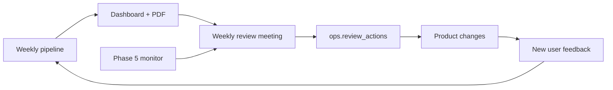

# Product feedback loop

Phase 5 closes the gap between **insights on a dashboard** and **product action**. This document describes the loop; the weekly meeting uses [weekly-review-template.md](weekly-review-template.md).

## Roles

| Role | Responsibility |
|------|----------------|
| **Data engineer** | Keeps pipeline + Phase 5 monitor green; tunes alert thresholds |
| **Product lead** | Prioritises actions; assigns owners |
| **User researcher** | Validates themes against quotes; flags false positives |
| **PM / squad** | Ships changes; documents outcomes in `review_actions.outcome_notes` |

## Artifacts

1. **Live dashboard** — executive summary, six questions, trends, PM Buddy
2. **Health report** — `phase5-operations/reports/latest_health_report.md`
3. **Alert log** — `ops.alerts` for drift, failures, theme spikes
4. **Action log** — `ops.review_actions` for accountability

## Measuring whether actions worked

After a product change ships, wait for **at least one weekly synthesis cycle** (new reviews collected + synthesised), then check:

- Did the relevant **theme mention count** fall in `ops.theme_trends`?
- Did **net sentiment** or **avg rating** on Trends move in the expected direction?
- Do new **evidence quotes** still mention the old pain point?

If metrics are flat, either the fix did not reach users, the sample is too small, or the theme keywords need refinement in Phase 2/3.

## Model and prompt refresh cadence

- **Pin** model + prompt version in `config/model_pin.yaml`
- **Review quarterly** or when Groq deprecates a model
- When prompts change, bump `PROMPT_VERSION` and record in `ops.model_registry`
- Re-run synthesis on a fixed model before comparing historical theme trends (edge case 5.3)

## Alert fatigue

If webhooks are too noisy:

1. Raise thresholds in `config/alert_thresholds.yaml`
2. Require **two consecutive runs** for theme spikes (already default)
3. Use `severity: info` theme spikes for review only — not webhook-critical

See [edgecases.md](../../docs/edgecases.md) §5.1–5.3.
